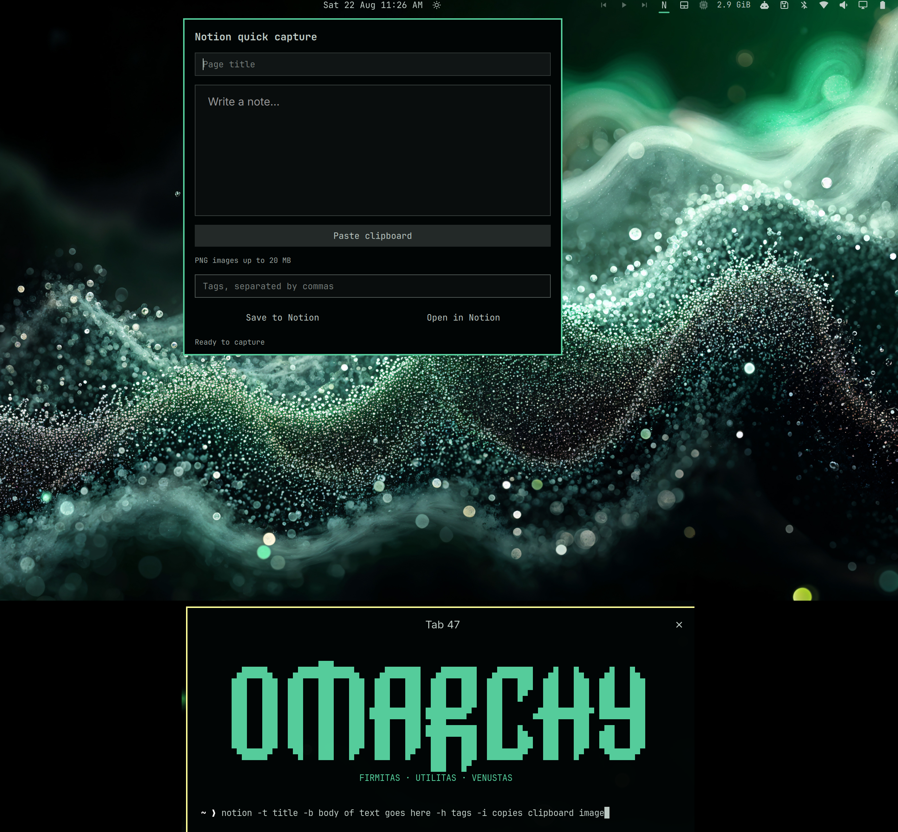

# Omarchy Notion Capture

An Omarchy Quickshell bar widget and agent-friendly CLI for quickly creating pages in a dedicated **Omarchy** database in Notion.



The widget captures a title, Markdown note body, tags, and an optional PNG from the clipboard. The CLI offers the same workflow for terminal users, scripts, and LLM agents.

## Requirements

- Omarchy with the plugin-capable shell
- A free or paid Notion workspace
- A Notion connection with **Insert content** capability
- `curl`, `jq`, `secret-tool`, and `wl-paste` (installed automatically)

## Install

```bash
git clone https://github.com/mpweaver/omarchy-notion
cd omarchy-notion
bash install.sh
```

The installer adds and enables `user.omarchy-notion`, places it on the right side of the bar, installs required Arch packages, and creates both `notion` and `omarchy-notion` CLI links.

## First-run setup

1. Open [Notion connections](https://www.notion.so/profile/integrations) and create a connection.
2. Give it **Insert content** capability and copy its installation access token.
3. In Notion, create or choose a normal parent page. Open that page's menu, choose **Connections**, and add the new connection.
4. Run `notion setup`.
5. Paste the token at the hidden prompt, then paste the shared parent page URL.

The setup wizard stores the token in the desktop keyring—not in this repository or a plain-text configuration file. It creates a database named **Omarchy** with Name, Tags, Source, and Created properties.

Verify setup:

```bash
notion status
notion -t "Test capture" -b "The Notion plugin is working." -h test
```

## Widget

Click the capital **N** in the Omarchy bar to open quick capture. Enter a title, note body, and optional comma-separated tags. **Paste clipboard** accepts text or a PNG up to 20 MB. **Open in Notion** opens the generated Omarchy database.

## CLI reference

### Quick capture flags

```text
-t, --title TITLE       Page title (required)
-b, --body TEXT         Markdown body; use - to read the body from stdin
-h, --tags TAGS         Comma-separated tags or hashtags
-s, --source SOURCE     Source label: Widget, CLI, Agent, or a custom value
-i, --image             Attach the PNG currently stored in the clipboard
--json                   Read a JSON capture object from stdin
```

Quotes are recommended for multi-word values:

```bash
notion -t "Quick thought" -b "Remember this tomorrow" -h "idea,personal"
notion -t "Screenshot" -b "Captured issue" -h bug -i
printf '%s\n' "A longer note from stdin" | notion -t "Terminal note" -b - -h terminal
```

### Commands

```text
notion setup             Create the Omarchy database and save credentials securely
notion status            Print JSON showing configuration and token status
notion capture [flags]   Create a database page
notion capture --json    Read an agent-friendly JSON object from stdin
notion clipboard-read    Return clipboard text or a cached PNG description as JSON
notion open              Open the Omarchy database in Notion
notion help              Show terminal usage
```

Agent JSON example:

```bash
printf '%s' '{"title":"Research task","body":"Investigate this topic","tags":["agent"],"source":"Agent"}' \
  | notion capture --json
```

An agent may provide an existing PNG using `image_path`; the file must be PNG and at most 20 MB. It is not deleted after upload unless the JSON explicitly includes `"delete_image": true`.

## Update

```bash
omarchy plugin update user.omarchy-notion --yes
bash ~/.config/omarchy/plugins/user.omarchy-notion/install.sh
```

## Remove

```bash
bash ~/.config/omarchy/plugins/user.omarchy-notion/uninstall.sh
```

Removal preserves the Notion database, desktop-keyring token, and `~/.config/omarchy-notion` settings.

## Agent installation

See [AGENT-INSTALL.md](AGENT-INSTALL.md) for explicit setup, security boundaries, verification, and automated capture instructions.

## Privacy and security

- No token, database ID, page ID, email address, or local home path is included in the repository.
- The installation access token is stored with `secret-tool` in the user's desktop keyring.
- The local configuration contains only generated Notion object IDs and the database URL and is created with user-only permissions.
- Review third-party Omarchy plugins before enabling them; plugins run as unsandboxed code in `omarchy-shell`.

## License

MIT
